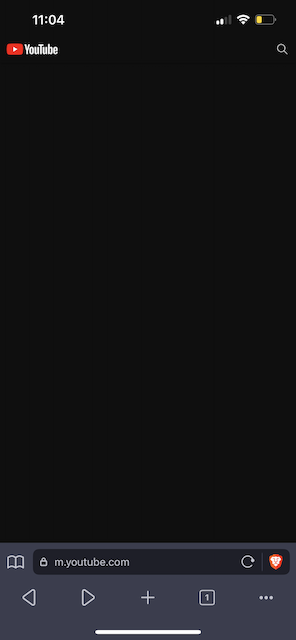
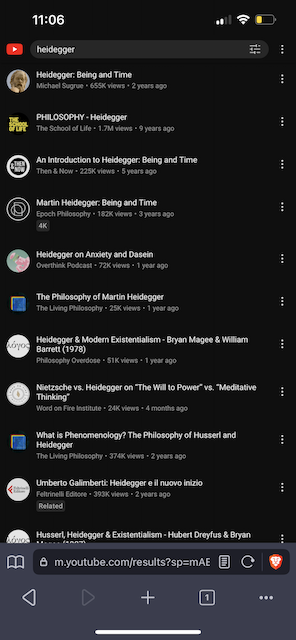

# Introduction
> “It would be better if there were nothing. Since there is more pain than pleasure on earth, every satisfaction is only transitory, creating new desires and new distresses, and the agony of the devoured animal is always far greater than the pleasure of the devourer”
― Arthur Schopenhauer

If you would like a less distracting experience viewing YouTube content on mobile. Brave -> Settings -> Brave Shields & Privacy -> Content Filtering -> Add Custom Filter List -> https://raw.githubusercontent.com/jdrrl/adblock-lists/master/brave-lists/yt-original0.txt -> Add.    

If you modify any of these lists, follow [these instructions](https://github.com/brave/ad-block/wiki/Testing-ad-block-rule-changes-in-Brave) to test your changes locally.

# Examples

## brave-unbreak.txti

Combined with all lists, including regional.

## coin-miners.txt

Tracks URLs that do coin mining.